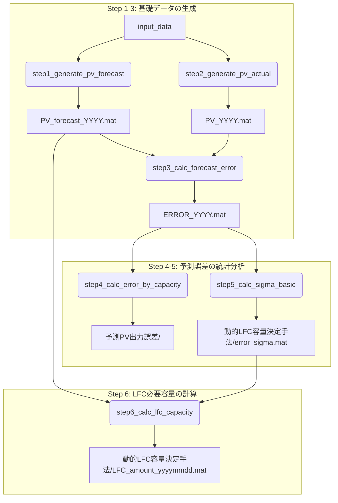

# PV予測誤差分析ツール — deploy パッケージ

このフォルダを他の人に渡すだけで、**どの環境でもそのまま実行できる**パッケージです。

---

## クイックスタート

### 1. 事前準備

1. **このフォルダ (`deploy/`) をどこかに配置する**（例: `C:\Users\yourname\PV_analysis\deploy\`）
2. **`input_data/` フォルダに必要なデータを配置する**（後述の「必要な入力ファイル一覧」を参照）

### 2. MATLABで実行

```matlab
% MATLABのカレントディレクトリを deploy/ フォルダに設定する
cd("C:\Users\yourname\PV_analysis\deploy")

% 全処理を一括実行
main_run
```

これだけで全処理が順番に実行され、結果が `output/` フォルダに保存されます。

---

## 処理フローの概要

このツールは、以下の6ステップでPV予測誤差を分析し、LFC必要容量を計算します。



---

## 各スクリプトの詳細

### メイン処理（`main_run.m` で実行される）

| ファイル名 | 役割 |
|:---|:---|
| `step1_generate_pv_forecast.m` | 予測日射量から**予測PV出力**を生成する |
| `step2_generate_pv_actual.m` | 1分間隔の実績データを30分間隔に補正し、**実績PV出力**を生成する |
| `step3_calc_forecast_error.m` | `(実績 - 予測) / 設備容量` で**予測誤差率 [%]** を計算する |
| `step4_calc_error_by_capacity.m` | 導入容量別の絶対誤差 [MW] を計算する |
| `step5_calc_sigma_basic.m` | 予測誤差の**標準偏差σ**をPV出力帯域別に計算する |
| `step6_calc_lfc_capacity.m` | **LFC必要容量**を計算する |

### ユーティリティ関数（他から呼び出される）

| ファイル名 | 役割 |
|:---|:---|
| `util_get_row_index_by_date.m` | 日付を行番号に変換する |
| `util_calc_sigma_per_band_basic.m` | `step5` の補助。帯域別σ計算の実処理 |
| `util_calc_sigma_per_band_extended.m` | `step5` の拡張版の補助。PVC/5刻みで帯域別σを計算 |
| `util_fit_normal_distribution.m` | 正規分布フィッティングとPDF描画 |
| `util_fit_normal_distribution_extended.m` | 同上の拡張版（ヒストグラム重ね表示対応） |
| `util_downsample_to_30min.m` | 1分→30分間隔へのダウンサンプリング |
| `util_get_plot_colors.m` | グラフ描画用カラーパレット定義 |
| `util_set_xaxis_time_labels.m` | グラフX軸の時刻ラベル設定 |

### 可視化・評価スクリプト（個別実行用）

| ファイル名 | 役割 |
|:---|:---|
| `viz_compare_forecast_vs_actual.m` | 予測と実績の比較グラフ |
| `viz_plot_error_bar_by_day.m` | 日別誤差の棒グラフ |
| `viz_plot_actual_output_by_day.m` | 特定日のPV実績出力グラフ |
| `eval_forecast_accuracy_boxplot.m` | 予測精度の評価（箱ひげ図） |
| `eval_calc_monthly_rmse.m` | 月別RMSE計算 |

---

## `ε_t^PV` と LFC容量の計算方法

### `ε_t^PV` の計算

`ε_t^PV` は、`step6` でLFC容量を計算する際に使われる「時刻tにおける予測誤差の代表値」です。これは以下の手順で計算されます。

1. **予測誤差のσを計算 (`step5`)**: 予測誤差率 `ERROR` を、予測PV出力の大きさで8つの帯域に分類し、各帯域の誤差分布の2σ幅（`μ±σ` の範囲幅）を `error_sigma(t, band)` として計算します。
2. **対象日の予測PV出力で帯域を選択 (`step6`)**: 計算したい日の時刻tにおける予測PV出力（例: 500MW）がどの帯域（例: 400〜600MW → 帯域3）に属するかを判断します。
3. **対応するσ幅を取得**: `ε_t^PV = error_sigma(t, 3)` のように、対応する帯域の2σ幅を `ε_t^PV` として使用します。

> つまり、**予測PV出力は誤差の大きさを直接計算するためには使っておらず、「どの帯域の誤差分布を使うか」を決めるための仕分けキーとして使っています。** `ε_t^PV` の実体は `ERROR` から統計的に求めた誤差のσ幅です。

### LFC容量の計算 (`step6`)

以下の式で、条件 `a_i * ε_t^PV + b_i - 95 >= 0` を満たす最小の `i` を探索します。

```
LFC_t = min{ i | a_i * ε_t^PV + b_i - 95 >= 0 }
```

| 変数 | 内容 |
|:---|:---|
| `i` | LFC容量の候補（2, 3, ..., 10%） |
| `a_i`, `b_i` | LFC容量 `i` のきの近似直線の傾きと切片。季節に応じて `input_data/approximation_lines/` から読み込む。 |
| `ε_t^PV` | 上記で計算した、時刻t・予測PV出力帯域に応じた予測誤差の2σ幅 [%] |

---

## よくあるエラーと対処法

| エラーメッセージ | 原因 | 対処法 |
|:---|:---|:---|
| `input_data フォルダが見つかりません` | カレントディレクトリが違う | `cd("deploy/")` を実行 |
| `ファイルが見つかりません (data_2018.mat)` | `input_data/` にファイルがない | `input_data/` に必要なファイルを配置 |
| `未定義の関数 'util_downsample_to_30min'` | `deploy/` フォルダがパスにない | MATLABのカレントディレクトリを `deploy/` に設定 |
| `変数 'ERROR' が未定義` | Step 3 が未実行 | `step3_calc_forecast_error(year)` を先に実行 |
| `変数 'data_all' が未定義` | Step 1 または Step 2 が未実行 | `main_run` で最初から実行し直す |
